# NexaLearn Platform

## Project Overview
NexaLearn is an educational platform similar to Classroom but with enhanced features designed to provide a seamless learning experience. The platform allows students to join sections or classrooms created by instructors. Students can access materials, take quizzes, and interact with instructors via real-time chat. Instructors have full control over creating and managing educational content, quizzes, and student progress monitoring.

## Technologies Used
- **.NET 8 MVC**: For building a robust, scalable, and maintainable application architecture.
- **SignalR**: Enables real-time communication, allowing instant messaging between students and instructors.
- **Repository Pattern & Unit of Work**: Ensures a clean data access layer and efficient database transaction management.
- **MimeKit**: For sending email notifications, enhancing communication.
- **Identity**: Provides secure authentication and authorization.
- **Entity Framework Core (EF Core)**: For interacting with the database using an ORM.
- **Razor Pages**: Enables dynamic and server-side rendering.
- **Bootstrap**: For creating a responsive and user-friendly interface.
- **JavaScript**: For client-side interactivity and enhanced user experience.

## Features

### For Students
- **Section Enrollment**: Students can join sections or classrooms using a unique code provided by the instructor.
- **Access Materials**: Students can view and download educational materials uploaded by instructors.
- **Take Quizzes**: Students can participate in quizzes using a session ID and receive instant feedback upon submission.
- **View Results**: After quiz completion, students can view their results, while instructors can review their answers.
- **Real-Time Chat**: Allows students to communicate with instructors and peers using an integrated chat system.

### For Instructors/Supervisors
- **Create Sections**: Instructors can create new sections or classrooms and manage the enrollment of students.
- **Upload Materials**: Instructors can upload and manage educational content for each section.
- **Create Quizzes**: Instructors can create and assign quizzes to students in different sections.
- **Monitor Student Progress**: Instructors can view student grades and responses for quizzes.
- **Real-Time Chat**: Instructors can communicate with students using the integrated chat system, facilitating real-time interactions.

## Screenshots

- **LogIn Page**  
  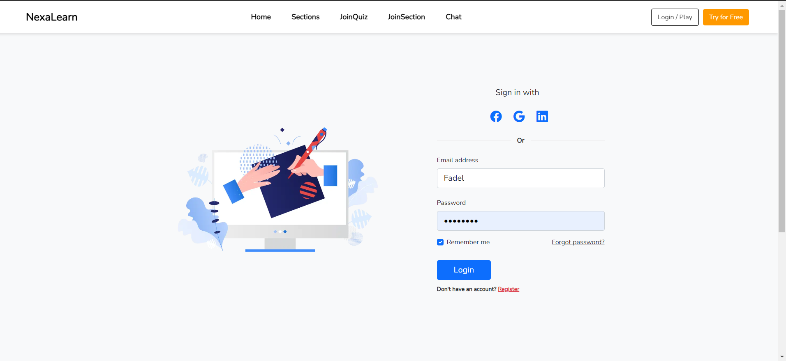
  
- **Profile**  
  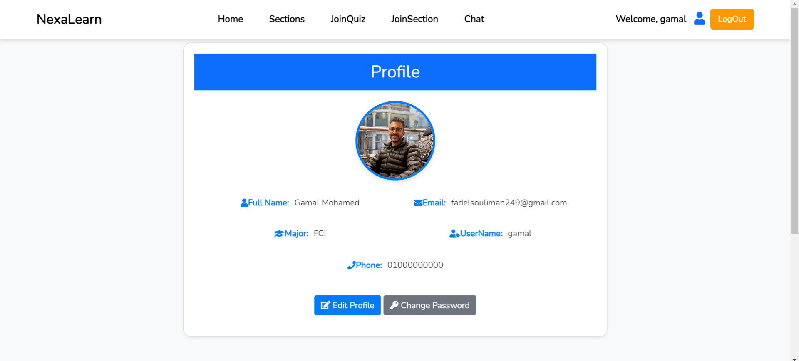

- **Section Enrollment**  
  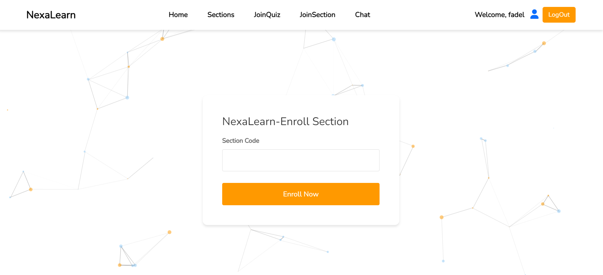 

- **Access Materials**  
  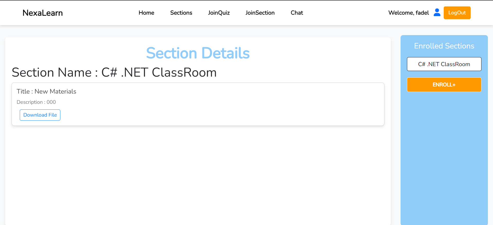

- **Take Quizzes**  
  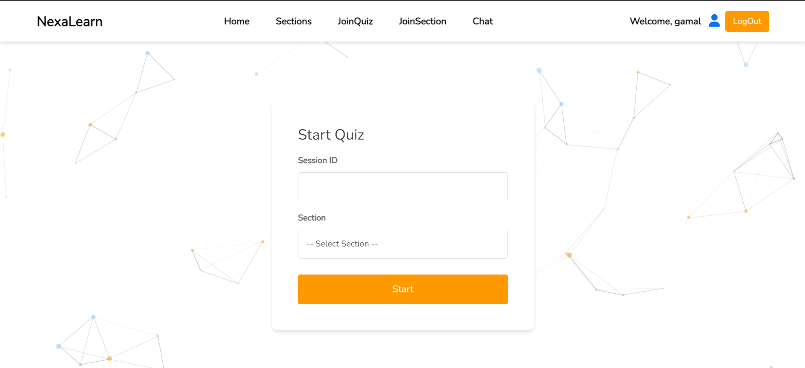

- **View Results**  
  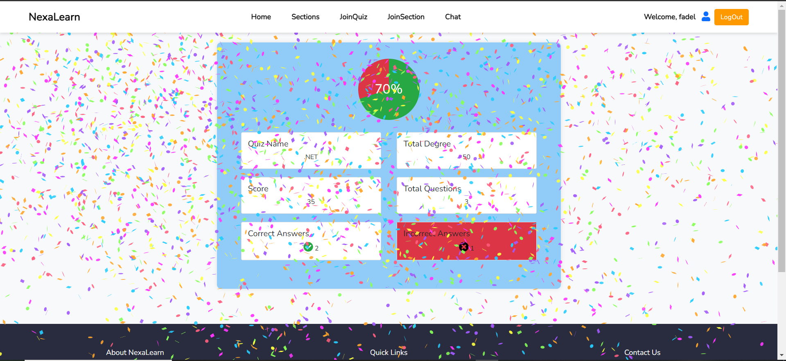

- **Real-Time Chat**  
  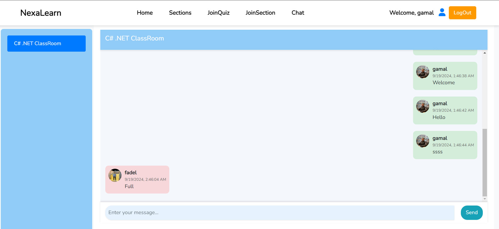
  
- **Admin Dashboard**  
  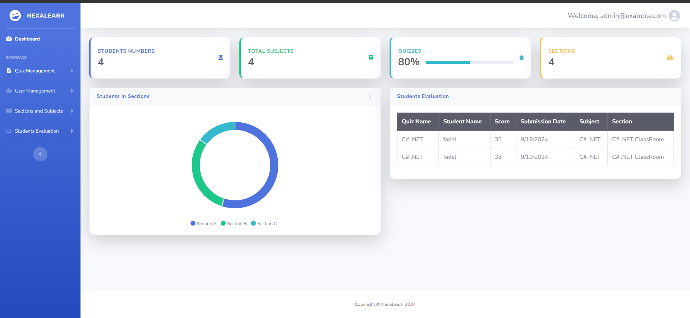

- **Create Quiz**  
  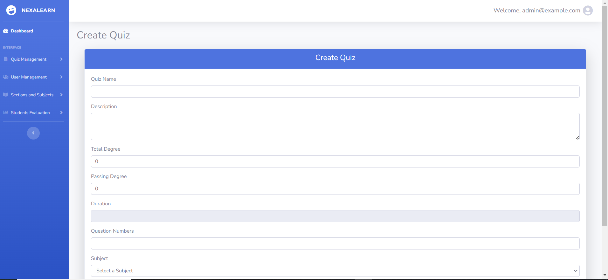

- **Create Sections**  
  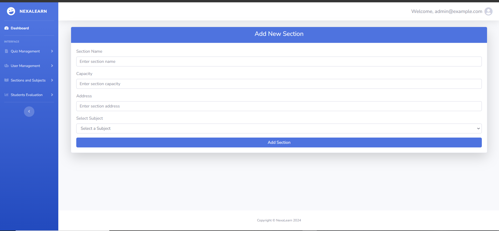

- **Create Subject**  
  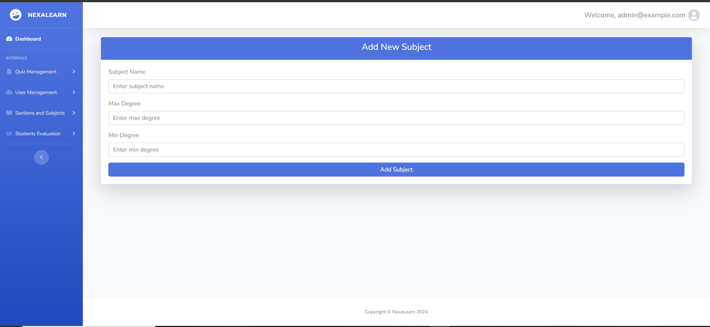

- **Upload Materials**  
  

- **Created Quizzes**  
  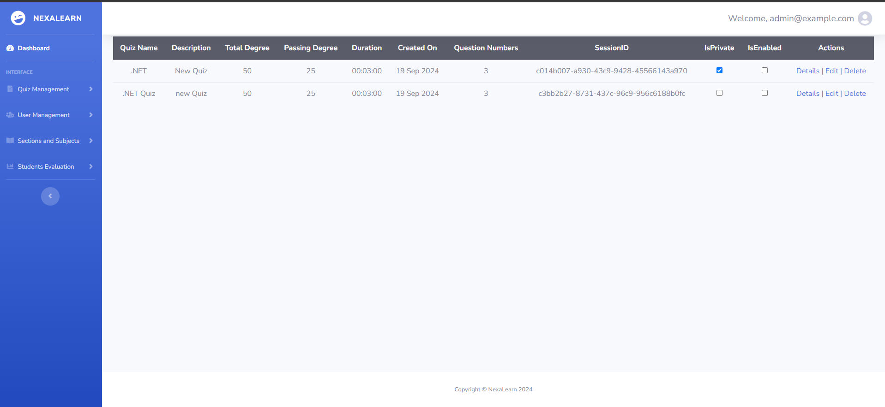

- **Monitor Student Progress**  
  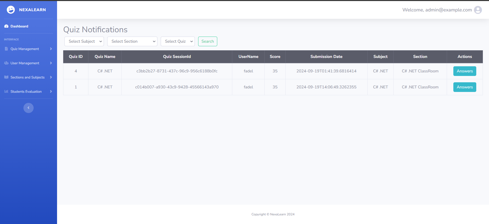
